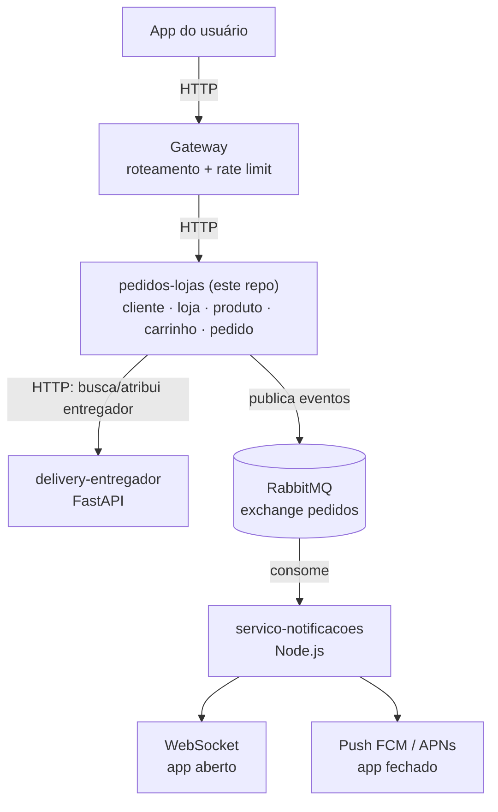
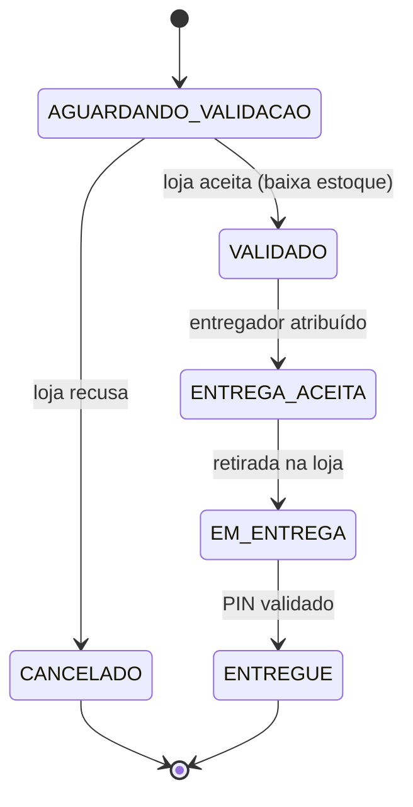

# delivery — Serviço de Pedidos e Lojas

[](https://github.com/Projeto-de-Software-Delivery/pedidos-lojas/actions/workflows/deploy.yml)


Serviço central de um app de delivery construído como arquitetura de
microsserviços para a disciplina de Projeto Ágil (Insper). Este repositório
concentra os domínios de **cliente, loja, produto, carrinho e pedido** — o
coração transacional do sistema — e se comunica de forma assíncrona com os
demais serviços via RabbitMQ.

> Procurando os outros serviços? Veja [Microsserviços do sistema](#microsserviços-do-sistema).

## Índice

- [Arquitetura do sistema](#arquitetura-do-sistema)
- [Microsserviços do sistema](#microsserviços-do-sistema)
- [Domínios deste serviço](#domínios-deste-serviço)
- [Máquina de estados do pedido](#máquina-de-estados-do-pedido)
- [Eventos publicados (RabbitMQ)](#eventos-publicados-rabbitmq)
- [Stack técnica](#stack-técnica)
- [Como rodar localmente](#como-rodar-localmente)
- [Variáveis de ambiente](#variáveis-de-ambiente)
- [Documentação da API](#documentação-da-api)
- [Testes e cobertura](#testes-e-cobertura)
- [Deploy](#deploy)
- [Fluxo de contribuição](#fluxo-de-contribuição)

## Arquitetura do sistema

O app é dividido em quatro serviços independentes, cada um em seu próprio
repositório, que conversam por HTTP (requisições síncronas) e por RabbitMQ
(eventos assíncronos de mudança de status do pedido):



Fluxo de ponta a ponta de um pedido:

1. Cliente cria o pedido → este serviço publica `pedido.criado`.
2. Loja aceita (baixa o estoque) → publica `pedido.validado`.
3. Na própria aceitação, este serviço já consulta o **delivery-entregador**
   via HTTP, escolhe um entregador disponível e publica `entrega.aceita`.
4. Entregador retira (`pedido.retirado`) e entrega (`pedido.entregue`,
   validando o PIN de 4 dígitos gerado na criação do pedido).
5. Em paralelo, o **servico-notificacoes** consome todos esses eventos do
   RabbitMQ e avisa cliente/loja/entregador em tempo real (WebSocket) ou via
   push, conforme o app esteja aberto ou fechado.

## Microsserviços do sistema

| Serviço | Repositório | Stack | Responsabilidade |
|---|---|---|---|
| **Gateway** | [`gateway`](https://github.com/Projeto-de-Software-Delivery/gateway) | Spring Boot | Ponto de entrada único: roteia para os serviços de domínio, aplica rate limiting por IP e expõe métricas/logs de acesso. |
| **Pedidos e Lojas** *(este repo)* | [`pedidos-lojas`](https://github.com/Projeto-de-Software-Delivery/pedidos-lojas) | Spring Boot + PostgreSQL | Cadastro de clientes, lojas, produtos e endereços; carrinho; ciclo de vida do pedido; integração com o entregador; publicação de eventos. |
| **Entregador** | [`delivery-entregador`](https://github.com/Projeto-de-Software-Delivery/delivery-entregador) | FastAPI + PostgreSQL | Cadastro de entregadores e controle de disponibilidade (`DISPONIVEL` / `EM_ENTREGA` / `INDISPONIVEL`), consultado via HTTP por este serviço. |
| **Notificações** | [`notificacoes`](https://github.com/Projeto-de-Software-Delivery/notificacoes) | Node.js | Consome os eventos do RabbitMQ e notifica os usuários via WebSocket (app aberto) ou push FCM/APNs (app fechado). |

Cada serviço tem seu próprio banco de dados e seu próprio ciclo de deploy —
não há acesso direto a dados de outro serviço, só via API ou evento.

## Domínios deste serviço

| Domínio | Rota base | O que faz |
|---|---|---|
| Cliente | `/clientes` | CRUD de clientes. |
| Endereço | `/clientes/{clienteId}/enderecos` | CRUD de endereços de entrega de um cliente. |
| Loja | `/lojas` | CRUD de lojas. |
| Produto | `/produtos` | CRUD de produtos (vinculados a uma loja), com controle de estoque. |
| Carrinho | `/clientes/{clienteId}/carrinho` | Adicionar/remover itens do carrinho de um cliente. |
| Pedido | `/clientes/{clienteId}/pedidos`, `/pedidos/{id}`, `/lojas/{lojaId}/pedidos/...` | Criação, consulta e ciclo de vida do pedido (aceitar/recusar pela loja). |
| Eventos | `/eventos/*` | Fallback HTTP para aplicar transições de status vindas de outros serviços quando a integração automática não se aplica. |

Lista completa de rotas e contratos: veja a [documentação OpenAPI](#documentação-da-api).

## Máquina de estados do pedido



- **AGUARDANDO_VALIDACAO**: pedido criado, estoque ainda não baixado.
- **VALIDADO**: loja aceitou e o estoque foi baixado (tudo-ou-nada: se faltar
  estoque de qualquer item, nada é persistido).
- **ENTREGA_ACEITA**: um entregador foi atribuído à corrida. A atribuição é
  automática — o backend consulta o serviço de entregador por alguém
  `DISPONIVEL` no exato momento em que a loja aceita o pedido. Se ninguém
  estiver livre, o pedido permanece em `VALIDADO` até uma nova tentativa.
- **EM_ENTREGA**: entregador retirou o pedido na loja.
- **ENTREGUE**: entrega concluída (PIN de 4 dígitos validado com o cliente);
  o entregador é liberado (`DISPONIVEL`) automaticamente nesse momento.
- **CANCELADO**: a loja recusou o pedido antes de aceitar (nenhum estoque é
  alterado, já que ele só é baixado na aceitação).

## Eventos publicados (RabbitMQ)

Exchange `pedidos` (tipo `topic`), routing key = tipo do evento. Contrato
completo em [`src/main/java/br/insper/delivery/pedido/payloads.md`](src/main/java/br/insper/delivery/pedido/payloads.md).

| Evento | Quando é publicado |
|---|---|
| `pedido.criado` | Cliente cria um pedido. |
| `pedido.validado` | Loja aceita o pedido e baixa o estoque. |
| `entrega.aceita` | Um entregador é atribuído à corrida (automático ou via fallback HTTP). |
| `pedido.retirado` | Entregador retira o pedido na loja *(consumido via `/eventos/pedido-retirado`)*. |
| `pedido.entregue` | Entrega concluída e PIN validado *(consumido via `/eventos/pedido-entregue`)*. |

Todo evento segue o envelope:

```json
{
  "eventId": "uuid",
  "eventType": "pedido.criado",
  "version": 1,
  "occurredAt": "2026-09-30T14:00:00Z",
  "data": { "...": "payload específico do evento" }
}
```

A publicação é *best-effort*: uma falha momentânea do broker é logada, mas
não derruba a operação de negócio que já foi concluída (ex.: o pedido já foi
validado e o estoque já foi baixado antes de tentar publicar).

## Stack técnica

- **Java 25** + **Spring Boot 4.1.1**
- Spring Web MVC, Spring Data JPA, Spring AMQP (RabbitMQ), Bean Validation
- **PostgreSQL** (produção e dev local via Docker) / **H2** (testes)
- **springdoc-openapi** para documentação OpenAPI/Swagger
- **JUnit 5 + Mockito + AssertJ**, cobertura via **JaCoCo**
- **Docker** / **GitHub Actions** (build, testes e deploy contínuo)

## Como rodar localmente

### Pré-requisitos

- JDK 25
- Docker e Docker Compose

### 1. Subir a infraestrutura local

```bash
docker compose up -d
```

Isso sobe:

- **PostgreSQL** em `localhost:5432`, com um banco e um usuário por serviço
  (`cliente_db`/`cliente_user`, `loja_db`/`loja_user`,
  `entregador_db`/`entregador_user` — ver
  [`db/init/01-schemas-e-usuarios.sql`](db/init/01-schemas-e-usuarios.sql),
  credenciais só para uso local).
- **RabbitMQ** em `localhost:5672` (painel de gerência em
  `localhost:15672`, usuário/senha padrão `guest`/`guest`).

### 2. Rodar a aplicação

```bash
./mvnw spring-boot:run
```

A API sobe em `http://localhost:8080`.

### 3. (Opcional) Rodar o serviço de entregador

Para testar a atribuição automática de entregadores de ponta a ponta, suba
também o [`delivery-entregador`](https://github.com/Projeto-de-Software-Delivery/delivery-entregador)
localmente e aponte `ENTREGADOR_SERVICE_URL` para ele (veja abaixo). Sem ele,
o backend funciona normalmente — a atribuição simplesmente não encontra
ninguém disponível e o pedido fica em `VALIDADO`.

## Variáveis de ambiente

| Variável | Padrão (dev) | Descrição |
|---|---|---|
| `SERVER_PORT` | `8080` | Porta HTTP da aplicação. |
| `DB_HOST` | `localhost` | Host do PostgreSQL. |
| `DB_PORT` | `5432` | Porta do PostgreSQL. |
| `DB_NAME` | `delivery` | Nome do banco. |
| `DB_USER` | `usuario` | Usuário do banco. |
| `DB_PASSWORD` | *(vazio)* | Senha do banco. |
| `RABBITMQ_HOST` | `localhost` | Host do RabbitMQ. |
| `RABBITMQ_PORT` | `5672` | Porta do RabbitMQ. |
| `RABBITMQ_USER` | `guest` | Usuário do RabbitMQ. |
| `RABBITMQ_PASSWORD` | `guest` | Senha do RabbitMQ. |
| `ENTREGADOR_SERVICE_URL` | `http://localhost:8081` | Base URL do serviço de entregador. |

## Documentação da API

Com a aplicação rodando:

- **Swagger UI**: `http://localhost:8080/swagger-ui.html`
- **OpenAPI JSON**: `http://localhost:8080/v3/api-docs`

## Testes e cobertura

```bash
./mvnw test
```

Gera o relatório de cobertura JaCoCo em `target/site/jacoco/index.html`. Os
testes usam H2 em memória (sem necessidade de subir Postgres/RabbitMQ) —
chamadas a serviços externos (ex.: o serviço de entregador) são tratadas como
*best-effort* e não quebram a suíte quando o serviço não está disponível.

## Deploy

Deploy contínuo via GitHub Actions ([`.github/workflows/deploy.yml`](.github/workflows/deploy.yml)):
a cada push em `main`, a aplicação é buildada, containerizada e publicada no
Docker Hub, e então implantada via SSH em uma instância EC2, na mesma rede
Docker dos demais serviços de infraestrutura (Postgres, RabbitMQ).

## Fluxo de contribuição

Este projeto segue um fluxo baseado em Jira + branch + PR, descrito em
[`.claude/CLAUDE.md`](.claude/CLAUDE.md): toda issue tem uma branch dedicada
(`KAN-<numero>-<slug>`), nunca se commita direto em `main`, e a automação
nativa do Jira transiciona a issue conforme o PR avança (branch → "Em
andamento", PR aberto → "Em análise", merge → "Concluído").
